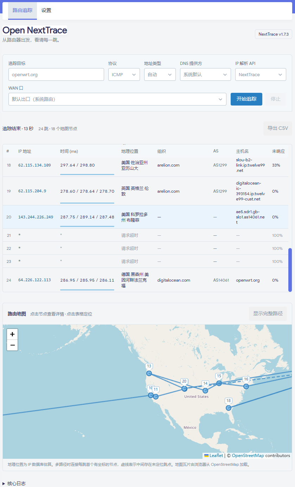
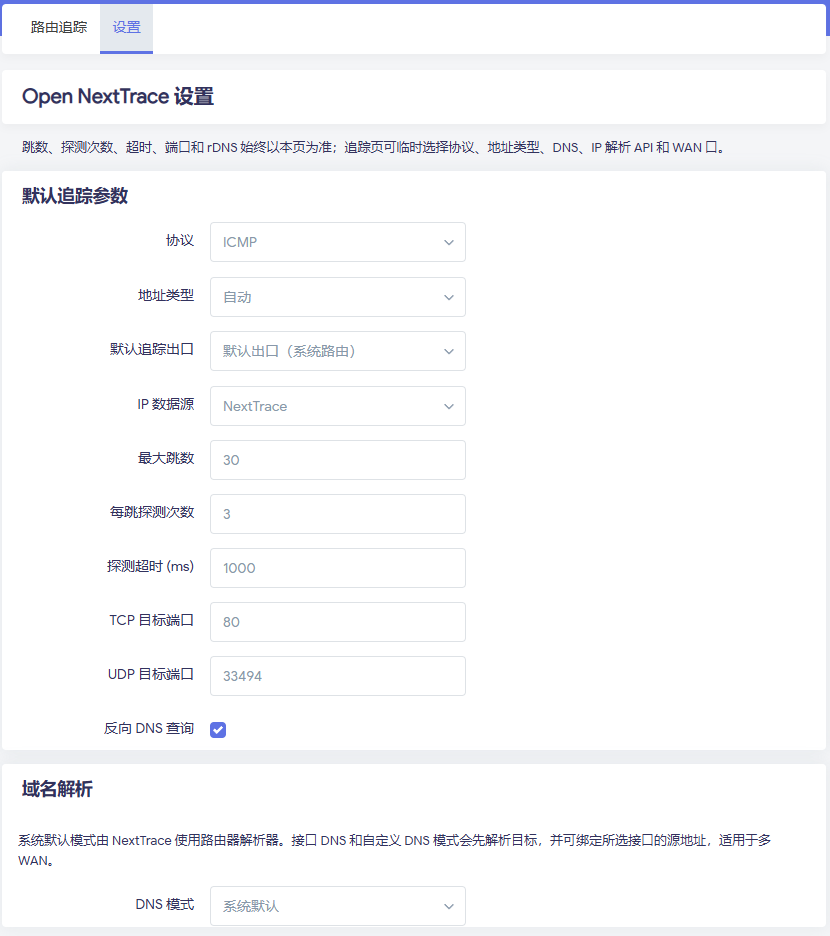

# Open NextTrace for LuCI

Open NextTrace 是基于 [NTrace-core](https://github.com/nxtrace/NTrace-core) 的 OpenWrt 路由追踪可视化插件。插件提供 LuCI 页面、逐跳结果和路由地图，界面设计参考 [OpenTrace](https://github.com/Archeb/opentrace)。核心软件包直接使用上游发布的对应架构二进制文件，安装路径为 `/usr/bin/nexttrace`。

## 界面

**路由追踪**：工具栏、逐跳结果和路由地图。



**设置**：默认追踪参数、DNS 和 IP 数据源配置。



## 功能

- 支持域名、IPv4 和 IPv6 目标，以及 ICMP、TCP、UDP 探测。域名解析返回多个地址时，可在目标输入框旁选择要追踪的 IP。
- 实时显示每跳 IP、延迟、地理位置、组织、ASN、主机名和未响应比例；支持 CSV 导出。
- 在地图上显示已定位的路由节点，并支持表格与地图间的定位。
- 支持默认系统出口或指定 WAN 接口；指定接口时使用 NextTrace 的 `--dev` 参数。
- 支持系统默认 DNS、WAN 接口 DNS 和自定义 DNS；IP 地理信息可选择 NextTrace、IPInfo、IP.SB、IP-API.com 或禁用。
- 追踪参数及默认选项由 UCI 保存，运行中的任务可停止，刷新页面后可恢复任务状态。

## 安装

从 [Releases](https://github.com/haohaoget/luci-app-open_nexttrace/releases) 下载与固件版本、包管理器和 CPU 架构匹配的 `open-nexttrace-core` 和 `luci-app-open_nexttrace` 两个软件包。OpenWrt 25.12 使用 APK，OpenWrt 24.10 使用 IPK。安装后，在 LuCI 的 **网络 → Open NextTrace** 打开插件。

APK 安装示例：

```sh
apk update
apk add --allow-untrusted --force-non-repository /tmp/open-nexttrace-core-*.apk /tmp/luci-app-open_nexttrace-*.apk
/etc/init.d/rpcd restart
```

IPK 安装示例：

```sh
opkg update
opkg install /tmp/open-nexttrace-core_*.ipk /tmp/luci-app-open_nexttrace_*.ipk
/etc/init.d/rpcd restart
```

软件包依赖 `luci-base`、`lua`、`luci-lib-nixio`、`luci-lib-jsonc`、`libubus-lua` 和 CA 证书，由包管理器处理。使用可信软件源或自行签名的软件包时，可按实际情况调整 APK 安装参数。

## 从源码构建

仓库包含两个 OpenWrt 软件包目录，可作为 feed 使用，也可复制到 OpenWrt 源码树的 `package/open-nexttrace/` 下。构建时选择 `LuCI → Applications → luci-app-open_nexttrace`，核心包会作为依赖选中。

```sh
mkdir -p package/open-nexttrace
cp -a /path/to/luci-app-open_nexttrace/luci-app-open_nexttrace package/open-nexttrace/
cp -a /path/to/luci-app-open_nexttrace/open-nexttrace-core package/open-nexttrace/
make menuconfig
make package/open-nexttrace/open-nexttrace-core/compile V=s
make package/open-nexttrace/luci-app-open_nexttrace/compile V=s
```

`open-nexttrace-core/Makefile` 将 OpenWrt 架构映射到上游 Linux 资产，覆盖 x86、ARM、MIPS、PowerPC、RISC-V、LoongArch 和 s390x。核心版本与 SHA-256 固定在 `open-nexttrace-core/version.mk`，下载阶段执行哈希校验。

## 自动化构建与发布

- **Update NextTrace core** 每天检查上游正式版本，更新核心版本和各架构 SHA-256；也支持手动运行。
- **Check plugin** 对提交和拉取请求运行前端、Python 与 Lua 测试。
- **Build OpenWrt packages** 使用 OpenWrt SDK 构建 APK 与 IPK。当前矩阵包括 `x86_64`、`mipsel_24kc`、`aarch64_cortex-a53`、`aarch64_cortex-a72`、`aarch64_cortex-a76`、`aarch64_generic`。构建产物仅包含各架构 `base` 目录中的核心包与 LuCI 包。

发布 Release 时，构建成功的软件包会上传到该 Release。单独推送标签不会触发构建。要为已有 Release 补充软件包，可手动运行 **Build OpenWrt packages**，并将 `release_tag` 设置为目标标签，例如 `V0.1`。

## 说明

追踪数据存放在路由器的 `/tmp` 中，重启后清除。地理位置由所选 IP 数据源估算；地图瓦片由浏览器从 OpenStreetMap 加载。中间节点未响应比例不代表端到端丢包。项目许可证为 GPL-3.0-only，第三方组件许可证见 [THIRD-PARTY-NOTICES.md](THIRD-PARTY-NOTICES.md)。
